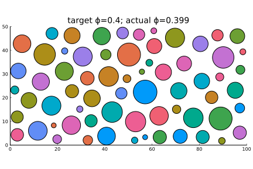

# BubbleBath.jl

[](https://github.com/mastrof/BubbleBath.jl/actions)
[](https://codecov.io/gh/mastrof/BubbleBath.jl)

Generate loose packings of spheres in orthorhombic domains, in 2 and 3 dimensions.

## Features
* Fill a domain with spheres from a given distribution of radii to reach a target
    packing fraction, or from already-sampled radii.
* Control minimum allowed distance between spheres.
* Decide whether spheres can cross through domain boundaries or not.

`BubbleBath.jl` just employs the trivial brute-force method,
with the only peculiarity that spheres are introduced in
order of decreasing radius.
Dense packings are obtained with reasonable performance,
but spatial correlations between sphere sizes are introduced.

This is **not** an algorithm to generate tight, space-filling packings.

## Example usage
The package exports a `Sphere{D}` type, which is just a wrapper around a 
position `pos::NTuple{D,Float64}` and a radius `radius::Float64`, and
the `bubblebath` function, which creates a loose packing of spheres in a domain.

To generate a (2D) distribution of spheres with radii uniformly distributed
within 1 and 5, in a rectangular domain of edges 100 and 50,
with a packing fraction 0.4, we can do
```julia
using BubbleBath
using Distributions: Uniform

radius_pdf = Uniform(1,5)
extent = (100, 50)
ϕ_max = 0.4
bath = bubblebath(radius_pdf, ϕ_max, extent)
```


If we want to impose a minimal distance between the surface of spheres,
the `min_distance` keyword can be used
```julia
radius_pdf = Uniform(1,5)
extent = (100, 50)
ϕ_max = 0.4
min_distance = 2.0
bath = bubblebath(radius_pdf, ϕ_max, extent; min_distance)
```


Again, the procedure in 3D is identical
```julia
radius_pdf = Uniform(10,25)
extent = (100, 100, 100)
ϕ_max = 0.3
min_distance = 10.0
bath = bubblebath(radius_pdf, ϕ_max, extent; min_distance)
```
